# Phase 2 Boundary Hardening (Corrected)

## Three-Tier Architecture

```mermaid
graph TD
    subgraph tier1 [Tier 1: Infrastructure Core -- FROZEN]
        sweeper["maintenance_sweeper.py"]
        retention["retention_policy.py"]
        recon_svc["domain/reconciliation_service.py"]
        recon_verify["domain/reconciliation_verify.py"]
        recon_alerts["domain/reconciliation_alerts.py"]
        struct_checks["domain/structural_checks.py"]
        observability["domain/observability_service.py"]
        m016["migrations/016..019"]
        retDoc["docs/RETENTION_INVARIANT.md"]
        tests["test_phase3_* + test_phase25_recon/obs/guards/replay"]
    end

    subgraph tier2 [Tier 2: Business Domain -- STABLE API]
        payment_svc["domain/payment_service.py"]
        shipment_svc["domain/shipment_service.py"]
        avail_svc["domain/availability_service.py"]
        doc_svc["domain/document_service.py"]
        fsm["domain/fsm_guards.py"]
        ports["domain/ports.py"]
    end

    subgraph tier3 [Tier 3: Extension Layer -- OPEN]
        ru_worker["ru_worker/*"]
        side_effects["side_effects/*"]
        webhooks["webhook_service/*"]
        cli_tools["cli/*"]
        config["config/schema.py"]
        new_migrations["migrations/020+"]
    end

    recon_svc -->|"imports"| payment_svc
    recon_svc -->|"imports"| shipment_svc
    recon_svc -->|"imports"| avail_svc
    recon_svc -->|"imports"| ports
    observability -->|"imports"| payment_svc
    ru_worker -->|"imports"| tier2
    side_effects -->|"implements"| ports
```

---

## 1. Authoritative Frozen Core File List (Tier 1)

### Reconciliation Engine (7 files)

- [maintenance_sweeper.py](.cursor/windmill-core-v1/maintenance_sweeper.py)
- [retention_policy.py](.cursor/windmill-core-v1/retention_policy.py)
- [domain/reconciliation_service.py](.cursor/windmill-core-v1/domain/reconciliation_service.py)
- [domain/reconciliation_verify.py](.cursor/windmill-core-v1/domain/reconciliation_verify.py)
- [domain/reconciliation_alerts.py](.cursor/windmill-core-v1/domain/reconciliation_alerts.py)
- [domain/structural_checks.py](.cursor/windmill-core-v1/domain/structural_checks.py)
- [domain/observability_service.py](.cursor/windmill-core-v1/domain/observability_service.py)

### Reconciliation Schema (4 files)

- [migrations/016_create_reconciliation_audit_log.sql](.cursor/windmill-core-v1/migrations/016_create_reconciliation_audit_log.sql)
- [migrations/017_create_reconciliation_suppressions.sql](.cursor/windmill-core-v1/migrations/017_create_reconciliation_suppressions.sql)
- [migrations/018_create_reconciliation_alerts.sql](.cursor/windmill-core-v1/migrations/018_create_reconciliation_alerts.sql)
- [migrations/019_add_retention_indexes.sql](.cursor/windmill-core-v1/migrations/019_add_retention_indexes.sql)

### Safety Contracts and Tests (8 files)

- [docs/RETENTION_INVARIANT.md](.cursor/windmill-core-v1/docs/RETENTION_INVARIANT.md)
- [tests/validation/test_phase3_alert_emission.py](.cursor/windmill-core-v1/tests/validation/test_phase3_alert_emission.py)
- [tests/validation/test_phase3_cache_read_model_contract.py](.cursor/windmill-core-v1/tests/validation/test_phase3_cache_read_model_contract.py)
- [tests/validation/test_phase3_l3_structural_checks.py](.cursor/windmill-core-v1/tests/validation/test_phase3_l3_structural_checks.py)
- [tests/validation/test_phase3_replay_verify.py](.cursor/windmill-core-v1/tests/validation/test_phase3_replay_verify.py)
- [tests/validation/test_phase3_structural_safety_contract.py](.cursor/windmill-core-v1/tests/validation/test_phase3_structural_safety_contract.py)
- [tests/validation/test_phase25_contract_guards.py](.cursor/windmill-core-v1/tests/validation/test_phase25_contract_guards.py)
- [tests/validation/test_phase25_replay_gate.py](.cursor/windmill-core-v1/tests/validation/test_phase25_replay_gate.py)

**Total: 19 frozen files.**

---

## 2. Business Domain Layer (Tier 2) -- Stable API, Not Frozen

These files may be modified and extended, subject to one constraint: **existing function signatures imported by Tier 1 must not change**.

The pinned API surface (derived from actual import analysis):

`**domain/payment_service.py**` -- pinned exports:

- `_derive_payment_status()` (used by `reconciliation_service.py` line 10, `observability_service.py` line 7)
- `_extract_order_total_minor()` (used by `reconciliation_service.py` line 10, `observability_service.py` line 7)

`**domain/shipment_service.py**` -- pinned exports:

- `recompute_order_cdek_cache_atomic()` (used by `reconciliation_service.py` line 11)
- `update_shipment_status_atomic()` (used by `reconciliation_service.py` line 11)

`**domain/availability_service.py**` -- pinned exports:

- `_ensure_snapshot_row()` (used by `reconciliation_service.py` line 8)

`**domain/ports.py**` -- pinned exports:

- `InvoiceStatusRequest` (used by `reconciliation_service.py` line 9)
- `ShipmentTrackingStatusRequest` (used by `reconciliation_service.py` line 9)

`**domain/document_service.py**` -- no pinned exports (not imported by Tier 1).

`**domain/fsm_guards.py**` -- no pinned exports (not imported by Tier 1).

**Tier 2 rules:**

- New functions: ALLOWED
- New files in `domain/`: ALLOWED (e.g. `domain/return_service.py`)
- Modifying body of pinned functions: ALLOWED (internal logic can change)
- Changing signature of pinned functions: FORBIDDEN (would break Tier 1)
- Removing pinned functions: FORBIDDEN

---

## 3. Updated Forbidden Extension Points

### Tier 1 (FROZEN -- zero modifications)

- No edits to any of the 19 files listed above
- No ALTER/DROP on reconciliation infrastructure tables (`reconciliation_audit_log`, `reconciliation_alerts`, `reconciliation_suppressions`)
- No new indexes on reconciliation infrastructure tables (beyond migration 019)
- No INSERT/UPDATE/DELETE on reconciliation infrastructure tables from code outside Tier 1

### Tier 2 (STABLE API -- extend only)

- No removal or signature changes of the 7 pinned function exports listed above
- No adding new imports FROM Tier 3 (ru_worker, side_effects) INTO Tier 2 modules
- No moving pinned functions to different modules

### Tier 3 (OPEN -- standard review)

- No restrictions beyond normal code review
- New migrations (020+) may create new tables or ALTER business tables; must not touch reconciliation tables
- New workers/adapters must import domain atomics, not raw SQL against business tables

---

## 4. Formal Boundary Definition (for `docs/PHASE2_BOUNDARY.md`)

> **Phase 2 Boundary Definition.** The codebase is organized into three tiers. **Tier 1 (Infrastructure Core)** comprises the reconciliation engine, retention policy, observability checks, structural safety checks, reconciliation schema migrations (016-019), and all Phase 3 / Phase 2.5 validation tests; these 19 files are frozen and must not be modified after Core Freeze. **Tier 2 (Business Domain)** comprises domain service modules (`payment_service`, `shipment_service`, `availability_service`, `document_service`, `fsm_guards`, `ports`); these files may be extended with new functionality, but the specific function signatures imported by Tier 1 (`_derive_payment_status`, `_extract_order_total_minor`, `recompute_order_cdek_cache_atomic`, `update_shipment_status_atomic`, `_ensure_snapshot_row`, `InvoiceStatusRequest`, `ShipmentTrackingStatusRequest`) constitute a pinned API surface that must not change in name, argument list, or return type. **Tier 3 (Extension Layer)** comprises workers, adapters, webhooks, CLI tools, configuration, and new migrations; these are freely extensible. The frozen Tier 1 test suite (117 tests) serves as the automated enforcement mechanism: any change that causes a Tier 1 test failure is a boundary violation and must be reverted.

